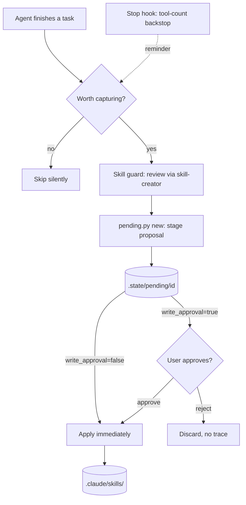

# autodidact


[](https://agentskills.io)


> A procedural-memory self-improvement loop for any [agentskills.io](https://agentskills.io)-compatible AI coding agent, modeled on Hermes Agent's `skill_manage` tool and its `write_approval` gate.

---

## About

At the end of a task, autodidact asks: *did we just learn something worth not
re-deriving next time?* If so, it drafts a skill (new, or a patch to an existing
one), runs it past a guard step, and stages it in an async approval queue instead of
writing straight to `.claude/skills/`.

Agent conversations regularly involve reverse-engineering undocumented behavior,
working around a trap in a specific order of steps, or getting corrected by the user
on a preference the code doesn't state. That knowledge is usually gone at the end of
the session. autodidact turns the highest-signal moments of a conversation into
durable, reusable skills — without ever writing to disk without a review step.

Two triggers, mirroring how Hermes actually works:

- **The agent's own judgment (primary).** At the natural end of any task, regardless
  of whether a hook fired.
- **A Stop-hook nudge (backstop).** `detect_complexity.py` counts tool calls in the
  last turn and injects a reminder past a threshold — a cheap catch-all, not a
  substitute for judgment.

Six proposal actions, mirroring Hermes' `skill_manage`: `create`, `patch`, `edit`,
`delete`, `write_file`, `remove_file`.

---

## Technologies

- **[agentskills.io](https://agentskills.io) SKILL.md format** — the plugin is
  agent-agnostic by design: it targets any agent (Claude Code, OpenCode, or otherwise)
  that supports this open skill spec plus Stop/UserPromptSubmit/SessionStart-equivalent
  hooks.
- **Python 3** — hook logic and the pending-queue CLI (`pending.py`,
  `detect_complexity.py`), stdlib only, no dependencies.
- **Bash** — hook wiring scripts (`inject_reminder.sh`, `list_pending.sh`).

---

## Prerequisites

- Any [agentskills.io](https://agentskills.io)-compatible AI coding agent with
  Stop/UserPromptSubmit/SessionStart-equivalent hooks (e.g. Claude Code, OpenCode).
- Python 3, available on `PATH` as `python`.
- Bash, for the two shell hooks.
- Optionally, a `skill-creator` skill installed in your project — see
  [Pairing with a skill-creator](#pairing-with-a-skill-creator) below. autodidact
  works without one; it just skips the guard step.

---

## Installation

### Clone the repository

```bash
git clone https://github.com/wagner-sousa/autodidact.git
cd autodidact
```

### Copy the plugin into your project

Paths below use Claude Code's layout as the example — swap `.claude/` for your
agent's own skills/commands directory if it differs.

```bash
cp -r skills/autodidact <your-project>/.claude/skills/
cp commands/*.md <your-project>/.claude/commands/
```

### Wire the hooks

`hooks/hooks.json` contains the ready-to-use Stop/UserPromptSubmit/SessionStart
block. Merge it into your agent's hook config (`.claude/settings.json` for Claude
Code; check `skills/autodidact/scripts/README.md` for other agents):

```bash
cp hooks/hooks.json <your-project>/.claude/hooks.json
# then merge the "hooks" key into .claude/settings.json — or point your agent
# at .claude/hooks.json directly if its settings format supports it.
```

See `skills/autodidact/scripts/README.md` for the full explanation of each hook,
including non-Claude-Code agents.

---

## Configuration

`skills/autodidact/config.json` (tracked in git, project-wide):

```json
{
  "write_approval": true,
  "scope": "project",
  "trigger": {
    "min_tool_calls": 5,
    "min_file_edits": 2,
    "readonly_threshold": 12
  }
}
```

| Key | Default | Effect |
| --- | --- | --- |
| `write_approval` | `true` | `true` = stage proposals in the async queue. `false` = apply immediately, no queue — trusted/single-user setups only. |
| `scope` | `"project"` | `"project"` = write to `.claude/skills/` (versioned, this repo only). `"user"` = write to `~/.claude/skills/` (survives clone/reset, shared across projects). |
| `trigger.min_tool_calls` | `5` | Stop-hook backstop: minimum tool calls in an edit-heavy turn to fire. |
| `trigger.min_file_edits` | `2` | Minimum `Edit`/`Write`/`NotebookEdit` calls for a turn to count as edit-heavy. |
| `trigger.readonly_threshold` | `12` | For read-only turns, the higher tool-call bar needed to fire instead. |

`SKILL_MANAGE_THRESHOLD` (env var) overrides `trigger.min_tool_calls` only, taking
precedence over `config.json`.

---

## Project Structure

```shell
autodidact/
├── skills/
│   └── autodidact/
│       ├── SKILL.md               # the loop: when it fires, how to propose/approve
│       ├── SKILL_CREATOR.md       # how to pair autodidact with a skill-creator
│       ├── config.json            # write_approval / scope / trigger thresholds
│       └── scripts/
│           ├── detect_complexity.py  # Stop hook
│           ├── inject_reminder.sh    # UserPromptSubmit hook
│           ├── pending.py            # approval queue CLI
│           ├── list_pending.sh       # SessionStart hook
│           └── README.md             # hook wiring instructions
├── commands/
│   ├── skill-learn.md             # /skill-learn
│   ├── skill-fork.md              # /skill-fork
│   └── skills-curator.md          # /skills-curator
├── hooks/
│   └── hooks.json                 # ready-to-merge Stop/UserPromptSubmit/SessionStart block
├── LICENSE
└── README.md
```

---

## Usage

Once installed, the loop runs on its own — no action needed for the default,
judgment-driven path. To drive it explicitly:

```bash
# Distill a skill from the current conversation, a path, a URL, or notes
/skill-learn

# Fork an external skill (Anthropic's, OpenAI's, or any repo) into your project
/skill-fork https://github.com/anthropics/skills/tree/main/skills/skill-creator

# Read-only health report on your skill library
/skills-curator
```

Manage proposals directly with the queue CLI:

```bash
python .claude/skills/autodidact/scripts/pending.py list
python .claude/skills/autodidact/scripts/pending.py show <id>
python .claude/skills/autodidact/scripts/pending.py approve <id>
python .claude/skills/autodidact/scripts/pending.py reject <id>
```

### Pairing with a skill-creator

autodidact's guard step reviews every drafted skill against a `skill-creator` skill
before staging it. It doesn't bundle one — fork an existing implementation instead of
reinventing it:

- Anthropic: https://github.com/anthropics/skills/tree/main/skills/skill-creator
- OpenAI: https://github.com/openai/skills/blob/main/skills/.system/skill-creator

See `skills/autodidact/SKILL_CREATOR.md` for the recommended fork workflow
(provenance stamping, layering your own conventions on top, re-syncing with
upstream). autodidact still works without a `skill-creator` installed — the guard
step is skipped rather than blocking the proposal.

---

## Architecture

<!-- Diagram source: https://mermaid.live -->



---

## License

This project is licensed under the MIT License. See the [LICENSE](LICENSE) file for
details.

---

## Contact

**Wagner Sousa**

[](https://github.com/wagner-sousa)

---
